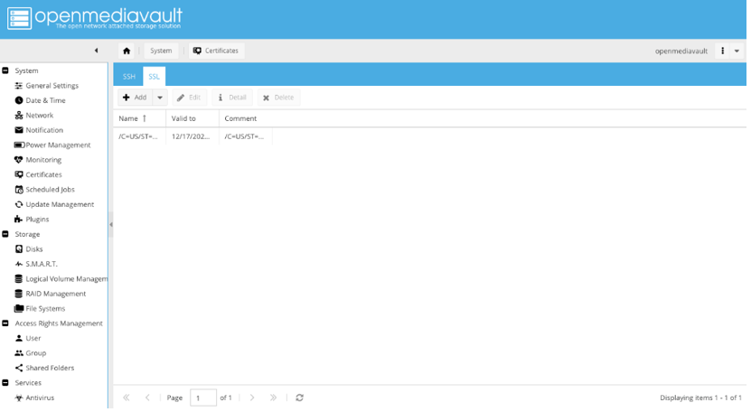
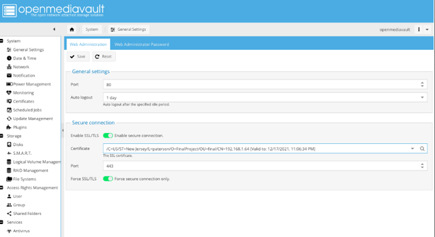

<b> Harold Santos</b>
<b> Prof.Robert</b>
<b> Linux Fundamentals </b>
<b> Fall 2021 </b>

# How to build a File Server with Open media vault

# Table of content

<b><i>Technology Definitions .... .... .. ...</i></b>

- OMV
- SSH 
- VirtualBox
- Ubuntu Server
- NAT and Bridge apdapter
- Omv extras
  <b> <i>Prerequisites: Create a VM using VirtualBox </i></b>
      Virtual machine specifications ….. …….. …. …..
      Debian server specifications ….. ……….. ……...
      Network Configuration …. ……………… ……... 
<b><i>Installing the operating system</i></b> …… …….. ……… ………… 
<b><i>Installing Open media vault </i></b>….. …………. …………….. …...
<b><i> Configuring Open media vault</i></b> ………… ………….. …………
Accessing the files “ shared folders”..... ……………. 
Configuring SMB access ………….. ………. ………
Users and groups …. …………. …………. ………..
Setting up SSH …… ……….. 
<b><i>Securing Open media vault</i></b> …… …………….. …………. ……
SSL certificate ….. ………… ……….. …………… …….
Update manager ………. ……………… ……. … …. …..
<b><i>Taking this project further</i></b> …. …….. ………….. ……………….
<b><i>Conclusion</i></b> …… ………. ……….. 
Problem Encounter…. … ……….. …

# Technology Definitions

<h6><b><i>What is OpenMediaVault?</i></b></h6>
Open media vault is a network attached storage (NAS) solution based on Debian Linux. It includes SSH, (S)FTP, SMB/CIFS, DAAP media server, RSync, BitTorrent client, and many other services. The framework's modular nature allows it to be expanded via plugins.
<h6><b><i>What is Secure Shell SSH?</i></b></h6>
SSH, also known as Secure Shell or Secure Socket Shell, is a network protocol that allows users, particularly system administrators, to access a computer securely over an insecure network.
<h6><b><i>What is VirtualBox?</i></b></h6>
VirtualBox is a general-purpose ample virtualizer for x86 hardware, targeted at server, desktop, and embedded use.
<h6><b><i>What is the difference between NAT and BRIDGET adapter?</i></b></h6>
Although the VM may access external resources, NAT mode will conceal all network activity as though it came from your Host OS. Bridged mode duplicates another node on the physical network, and if DHCP is enabled on the network, your VM will obtain its own IP address.
<h6><b><i>What is OMV extras?</i></b></h6>
OMV-Extras.org creates value-added Open media vault plugins that dramatically expand server capabilities. Furthermore, OMV-Extras.org makes it simple to install Open media vault on Raspberry Pis, Armbian-supported Single Board Computers, and 32bit - x86 systems.

# Creating the Virtual Machine

<b>Creating a virtual machine</b>

Here In this photo, In the Name field type any name you prefer.

In memory size screen, Apply the default setting for base memory. The default value is 2048. 

Select the option “Create a virtual hard disk now” default setting.

On the hard disk file type screen, Select the default setting which is the VirtualBox Disk Image(VDI). Then click Next. 

On the next screen, There are options for Dynamically Allocated or a Fixed-size virtual disk file. The default is automatically selected as Dynamically Allocated.

Then, choose the VM disk image file’s location and size. Then set it to the maximum size to the host of the file system but here I had set it to 50 GB. 

Notice on this photo it is set up to Debian 50 VM and it is in a running state.

# Installing Open Media Vault
The startup screen of OpenMediaVault should appear. Select Install from the boot menu and press the Enter key to continue. 

The following screen, choose the default language utilized for the installation and press enter to continue.

The following snapshot selects the system location from the offered list based on the geographical location - Continent -> Country- and presses the enter key to proceed.

The following option will appear on the succeeding page, requiring network configuration. To proceed, select the initial network interface to be set further and press the enter key. The network interface will then be automatically setup using the DHCP protocol.

Following, because the network has been properly setup with IP settings, input the system hostname and hit the enter key to go to the next page.

In the next step, the domain appears but leave it blank and press enter to continue.

For the root administrative account, a secure password must be created; repeat the password on the following page and press enter to proceed.

The package management window will look like this on the screen. Select a Debian mirror archive that is near to your actual location, then press enter to proceed.

On this screen select the deb.debian.org default setting and click enter.

The installer will request proxy information to setup the Debian package manager's access. This is most likely not a need, so leave it blank and continue.

When the installation is finished, remove the installation CD or USB and press enter to finish the installation and reboot the machine under the new operating system.

After rebooting the machine enter the username and password that it was set up earlier

# Configuring Open Media Vault

This screenshot was taken after locating the IP address on the previous screen. The user must open a web browser and enter the IP address, which will direct them to this page. The login is admin, and the password is open media vault.

After login, the following information will appear on the screen

After you've navigated to Storage -> File Systems, click the Create button. Choose an array file system type, such as EXT4. To finish the file system, press the OK button.

Select the RAID device array from the file and press the top-mount button to access the system's storage. To save the changes, click the apply button.

After the previous step, now choose Shared Folders from the Access Rights Management menu at the right. by clicking the choice add, it will appear a busy dialogue box that seems like this

Next, select the Shares tab—this is where I set the shared folders to appear when we connect to the NAS over the network. When you click Add, a dialogue box will display. Allows the shared folder in SMB to be used.

# Setting up a user account
Click Access right management, then click User and select Add to create a new user with the following information.

# Setting up a group account

# SSH 
SSH allows the user to practice the command line to access your NAS.

# SSL 
SSL certificates can be used to secure web interfaces and SSH connections. The screenshot below demonstrates how to generate an SSL certificate.

The snapshot below will show all useful packages that need to be updated, making the open media vault more secure.

# Taking the project further
You are making it simpler for workers to access their material by transferring your files to Open media vault . You can access your files from anywhere and on any device, whether you're at home, the office, or on your way to a meeting. This is something that ordinary file sharing struggle to match.

# Conclusion
After you've learnt how to construct a File Server using OpenMediaVault, you'll be able to make a variety of helpful things. There are several choices for expanding on this project or making it beneficial for this endeavor. Move the file server, for example, to the cloud.

# Issues Encountered
I don’t have a photo of the issue but what had happened was my router was giving me a different IP address that wasn’t working and I had to switch the network type from bridge to NAT and then somehow it had worked. 

# Works Cited 
    • https://www.youtube.com/watch?v=zDDOTiSSWlE
    • https://opensource.com/article/18/9/openmediavault
    • https://openmediavault.readthedocs.io/en/5.x/new_user_guide/newuserguide.html

