# Lab 3 | Installing software and navigating the file system | Answers
Assignment description [here](https://raw.githubusercontent.com/ra559/cis106/main/labs/lab3.md)

## Question 1
1. Which command did you use to search for the themes and to install them?
   apt search 'gtk theme' & sudo apt install yuyo-gtk-theme.
2. Which commands did you use to find and install the web browser? apt search web browser.
3.1 What is the name of the package?
qutebrowser-qtwebkit

3.2 What dependencies are needed in order to install the package? (you can either take a screenshot of the terminal or copy and paste from the terminal)
0 upgraded, 31 newly installed, 0 to remove and 21 not upgraded.
Need to get 25.3 MB of archives.

3.3 How much disk space will the package utilize after installation?
 After this operation, 106 MB of additional disk space will be used.

## Question 2
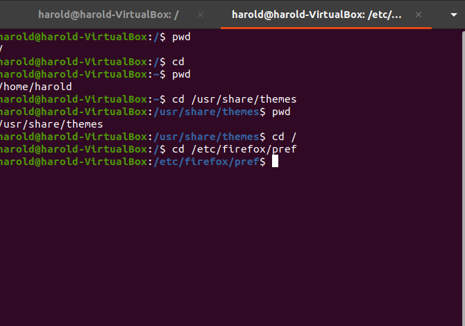
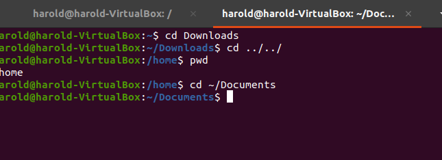

## Question 3
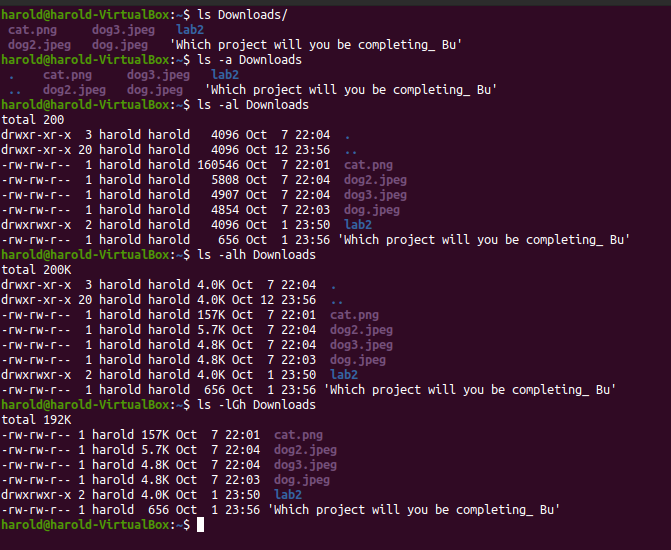
## Question 4
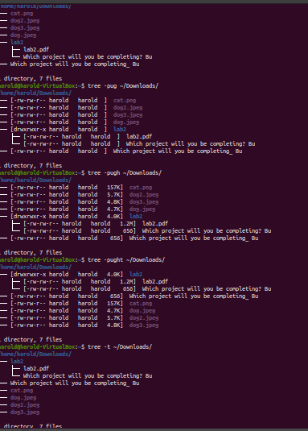
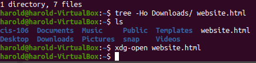
## Question 5
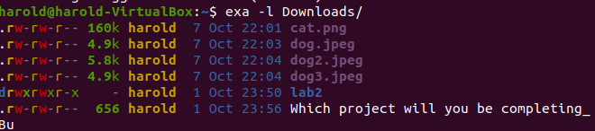
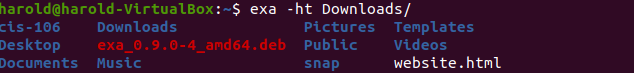
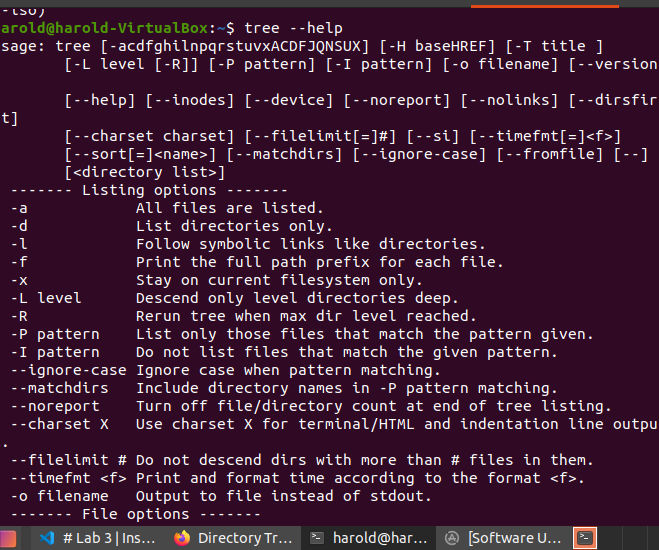
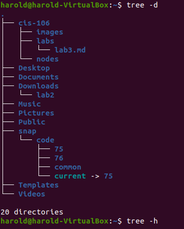
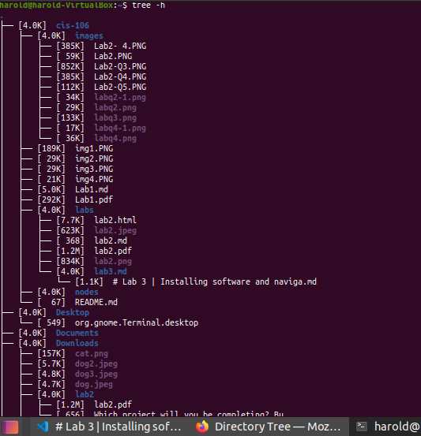
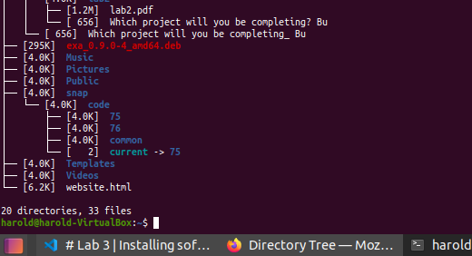
