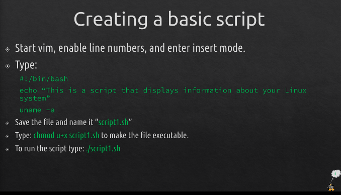
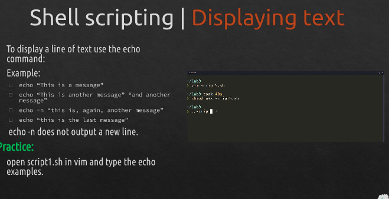
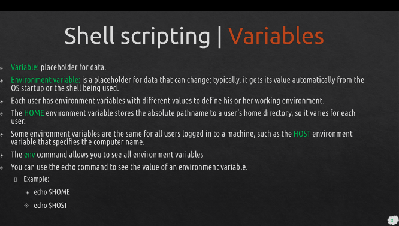
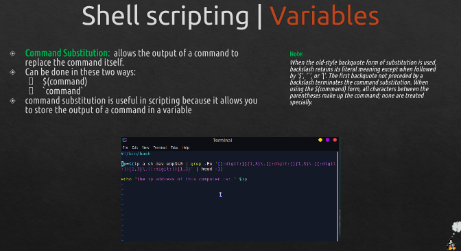
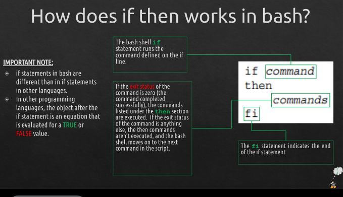
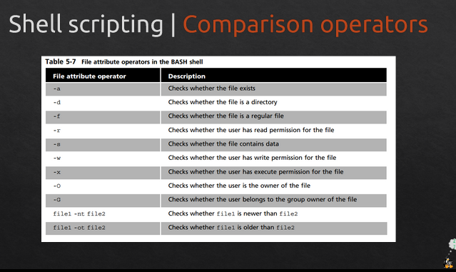
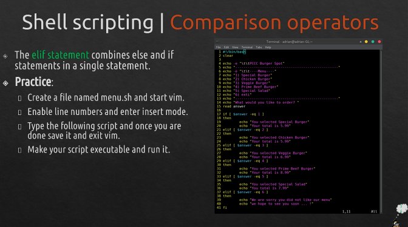
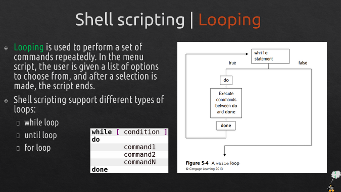

# Final Notes
- [Final Notes](#final-notes)
- [Lecture 2: Installing Ubuntu, Virtualization, and the Raspberry PI](#lecture-2-installing-ubuntu-virtualization-and-the-raspberry-pi)
- [Server-side - VDI](#server-side---vdi)
- [VirtualBox](#virtualbox)
- [Using VirtualBox](#using-virtualbox)
- [Creating a basic script](#creating-a-basic-script)
- [Displaying text](#displaying-text)
- [Working with variables](#working-with-variables)
- [How does if then works in bash?](#how-does-if-then-works-in-bash)
- [Operators](#operators)
- [Looping](#looping)
# Lecture 2: Installing Ubuntu, Virtualization, and the Raspberry PI

# Server-side - VDI
- Thick client or fat client
- Thin client
- Zero client

# VirtualBox

# Using VirtualBox
# Lecture 8 | Shell scripting

# Creating a basic script 

# Displaying text

# Working with variables

# How does if then works in bash?

# Operators 

# Looping

