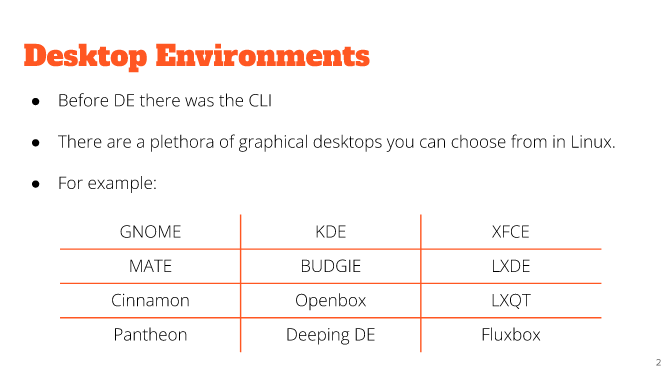
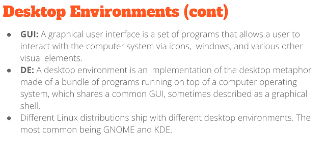
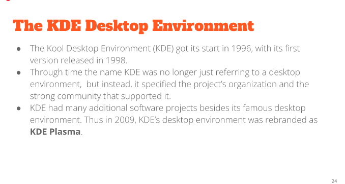

# Lecture 3

# Desktop Environments

*Continued*
Includes 
- Desktop settings
- Display Manager
- File Manager
- Icons 
- Favorites Bar
- Launcher
- Menus
- Panels
- System Trays
- Widgets
- Window Manager

# The KDE Desktop Environment
