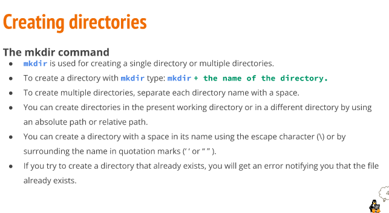
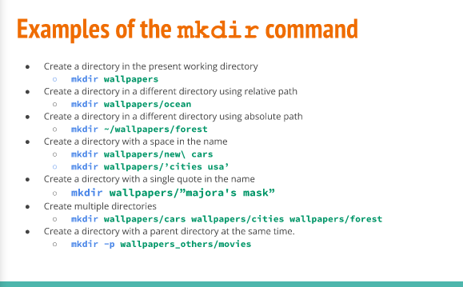
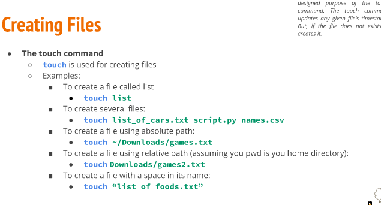
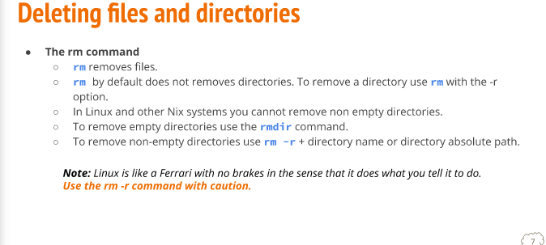
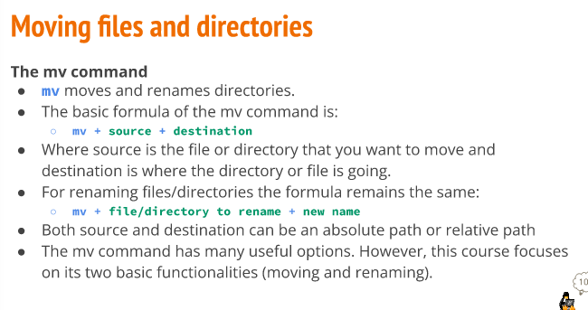
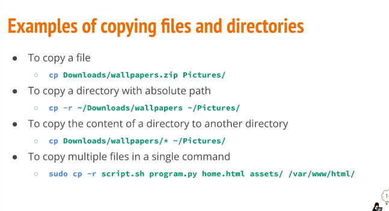
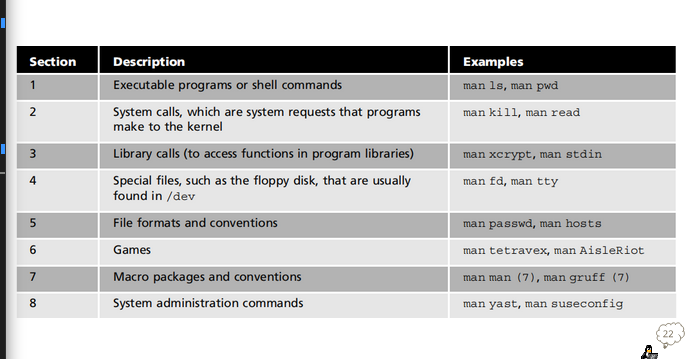
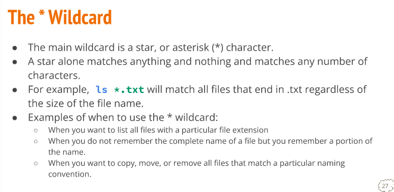
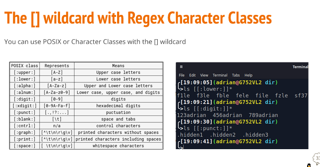
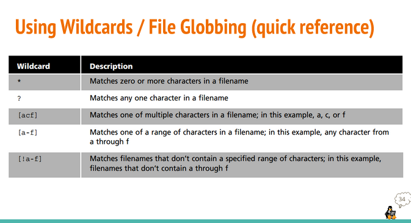

# Lecture 4 | Managing Files and Directories

# Creating Files and Directories
- MKDIR Command is used for creating a single directory or multiple directories. 

# Examples

# Creating files

# Deleting Files and directories 

# Moving Files and directories

# Copying files and dirextories Examples

# Wildcard

