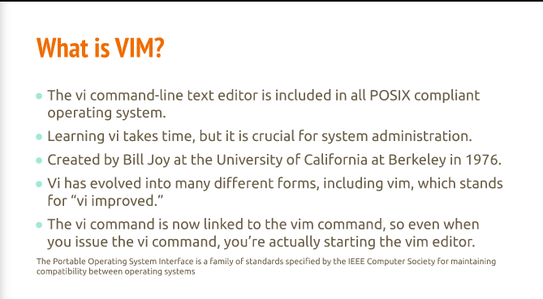
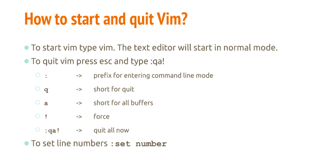
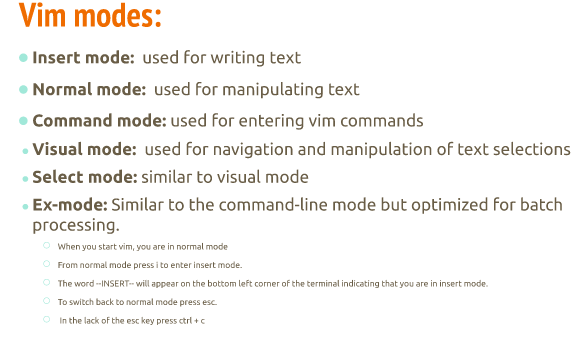
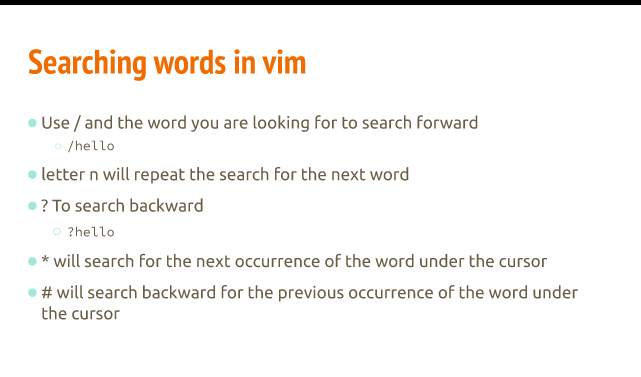
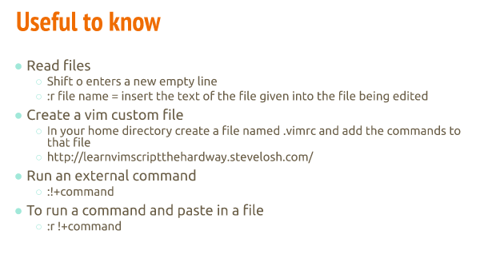

# Lecture 6 | The basics of VIM

# What is VIM?

# How to use vim

- There are 6 different modes for VIM

# Saving and quitting vim
- :w - to save
- :wq - to save and quit

# Editing a file with VIM
- :e new.txt -> will open new.txt and allow you to edit

# Searching words in vim

# Useful to know 
